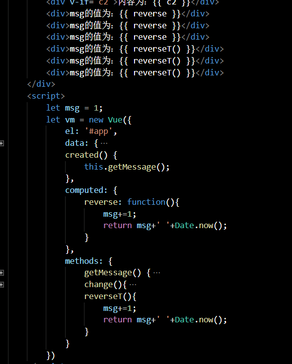
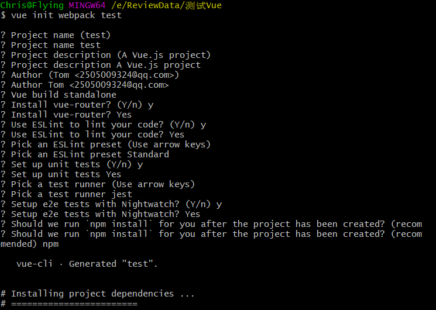

## Vue知识点

1. Vue 的优点

2. 轻量级框架：

   - 只关注视图层
   - 组件化
   - 结构、视图、数据分离
   - 虚拟DOM，提高运行效率

3. 为什么使用key？

   - 给每个节点添加唯一标识，diff算法能够识别此节点，高效更新虚拟DOM

4. computed与watch

   - computed 是基于响应式依赖进行缓存的，如果data中的属性未发生变化，则computed中的对应方法则不会再次执行

     

     

5. keep-alive

   + 是Vue提供的一个抽象组件，对包含的组件进行缓存，保留组件状态避免被重新渲染，当组件在keep-alive内被切换时，组件的activated、deactivated这两个生命周期钩子函数会被执行，例如浏览音乐软件某列表组件并滑动到某一位置，软后切换导航栏到另一专栏后在切换到该专栏，该列表组件的位置状态为之前的状态，页面不会重新渲染

     

6. Class与Style的绑定

   + 使用v-bind处理之间的绑定,只需要通过表达式计算出字符串结果即可,表达结果的类型除了字符串，还包括对象和数组

     ```html
     <!-- class是否存在，在于isActive的值是真是假，如果为真值，则class=active；如果为假值，则class不存在 -->
     <div v-bind:class="{ active: isActive }"></div>
     <div :class="{active: isActive}"></div>	<!-- 简写 -->
     <!-- 绑定多个class属性 -->
     <div
       class="static"
       v-bind:class="{ active: isActive, 'text-danger': hasError }"
     ></div>
     ```

7. Vue全家桶

   - vue-cli 是一个基于Vue.js 进行快速开发的完整系统

     ```js
     //通过 @vue/cli 搭建交互式的项目脚手架
     npm install -g @vue/cli 	 //安装vue-cli
     通过 vue init webpack 项目名	 //创建你的项目
     ```

     

     
   
8. better-scroll

   + BetterScroll是一款解决移动端各种滚动场景需求的插件
   + 封装轮播图
   + 实现窗口的滚动效果
   
9. js-pinyin

   + 汉子拼音转换工具

10. mixin

    + 混入提供了一种非常灵活的方式，来分发Vue组件中的可复用的功能，一个混入对象可以包含任意组件选项

      ```js
      //官网上的例子
      var mixin = {
        data: function () {
          return {
            message: 'hello',
            foo: 'abc'
          }
        }
      }
      
      new Vue({
        mixins: [mixin],
        data: function () {
          return {
            message: 'goodbye',
            bar: 'def'
          }
        },
        created: function () {
          console.log(this.$data)
          // => { message: "goodbye", foo: "abc", bar: "def" }
        }
      })
      ```

      