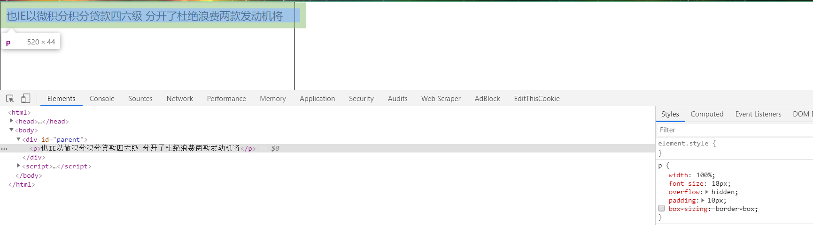
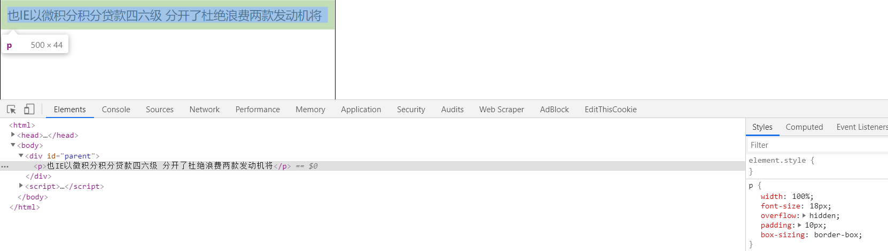
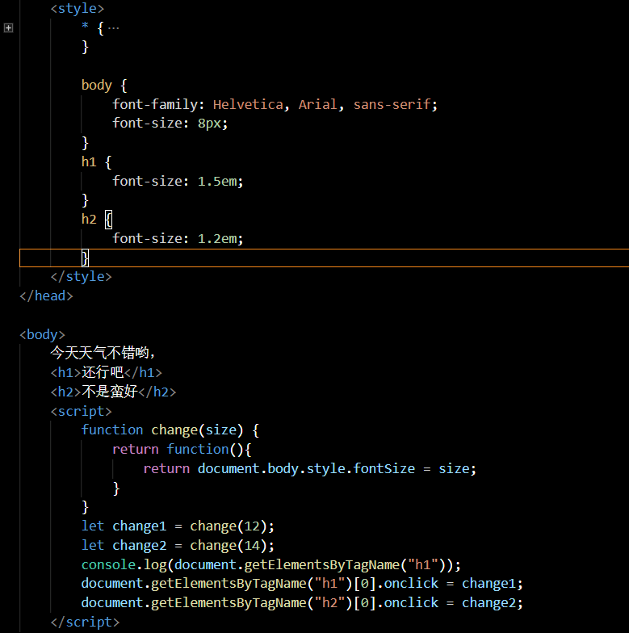
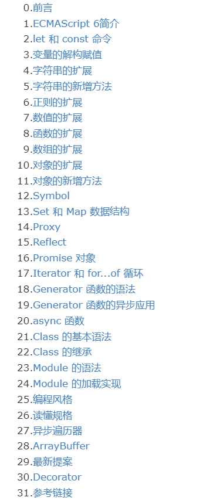
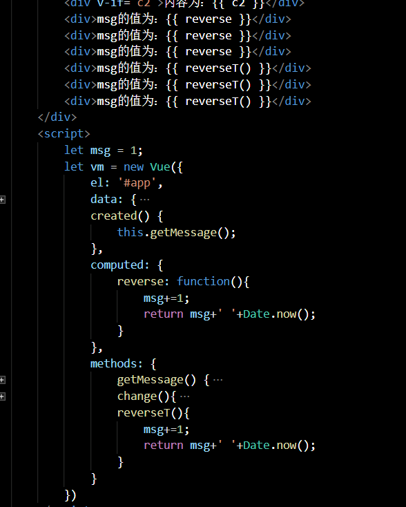
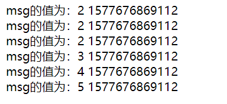
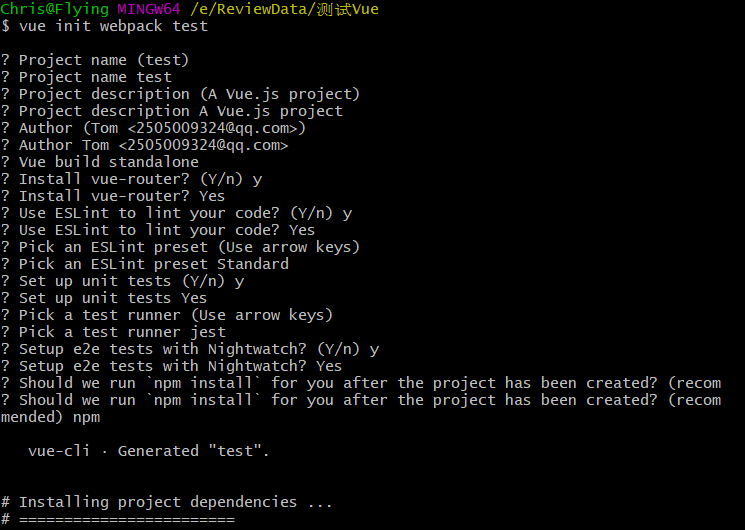
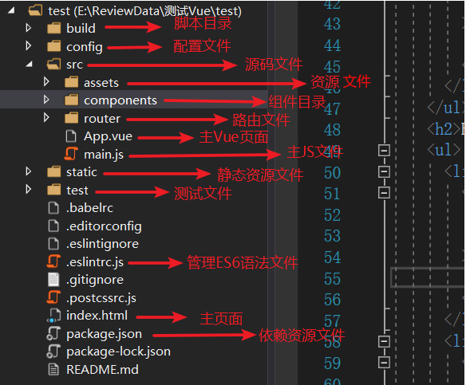

## HTML、CSS知识点

1. 标签特性 
   - 不区分大小写、一般以小写为标准
   - 注释方式 <!-- 注释文字 -->
   - 标签的语义化
     - 明白每个标签的用途

2. HTML 标签分类

   + 块级元素
     + div、p、h1...h6、列表等
   + 行内元素
     + a、span、br、i等
   + 行内块元素
     + img、input等

3. CSS（层叠样式表）几种引用方式

   - 内联

     ```html
     <p style="color:blue;"></p>
     ```

   - 嵌入式

     ```html
     <style type="text/css">...</style>
     ```

   - 外部引用

     ```html
     <link rel="stylesheet" href="..." type="css/text" />
     ```

   - CSS 样式优先级——内联>嵌入>外部

4. 选择器

   + 标签选择器 标签名
   + 类选择器 .className
   + ID选择器 #id
   + 通用选择器 *
   + 伪类选择器 :hover、:active、:visited、:focus
   + 后代选择器 >

5. 判断使用哪个CSS样式

   + 根据权值不同进行样式的选择，标签的权值为1、类选择符的权值为10、ID选择符的权值为100
   + 最高权值的设置——!important

6. CSS 布局方式

   + 文档流布局 Flow
   + Float 浮动布局
   + 层布局 使用定位方式(三种定位方式)
   + CSS3 弹性布局 display:flex;
   
7. 响应式布局

   + 媒介查询和px布局
     + 在head标签中添加meta 标签

       ```js
       <meta name="viewport" content="width=device-width,initial-scale=1,maximum-scale=1,user-scalable=no"></meta>
       
       name:viewport	用户在终端的可视区域
       width=device-width		可视区域的宽度为设备宽度
       initial-scale		初始缩放比例
       maximum-scale		最大缩放比例
       user-scalable		是否允许用户手动缩放,默认值为yes
       ```

     + 通过媒介查询

       ```js
       @media screen and(max-width=980px){
           #head{}
           #content{}
           #footer{}
       }
       如果需要兼容不同手机终端，则分别设置不同样式
       例如：
       /** iPad **/
       @media only screen and (min-width:768px) and (max-width:1024px){}
       /** iPhone **/
       @media only screen and (min-width:320px) and (max-width:767px){}
       ```

   + 通过百分比布局实现响应式布局
     + top、bottom、left、right

       ```js
       子元素的top和bottom 设置百分比，相对于默认定位的父元素的高度
       子元素的left和right 设置百分比，相对于默认定位的父元素的宽度
       ```

     + padding、margin

       ```js
       子元素设置padding 设置百分比，在垂直、水平方向，都是相对于父元素的width
       margin 同样如此
       ```

   + rem布局，是一个灵活的、可扩展的单位，由浏览器转化像素并显示，只相对于浏览器根元素的font-size

   + vw/vh 自适应布局

8. box-sizing的含义与用法

   + 通过收缩内边距来完成标签样式排版溢出问题

     

     

## JS语法

1. JS中的offsetWidth、clientWidth、scrollWidth的含义及区别
   + offsetWidth: 水平方向 width+左右padding+左右border-width
   + clientWidth: 水平方向 width+左右padding
   + scrollWidth: 水平方向，内容宽度，不超出内容为盒子的clientWidth
   
2. JS动画与CSS3动画的区别

   + JS动画代码复杂度相对CSS3动画来说较为复杂
   + JS动画在主线程上运行，CSS3动画在合成器线程上运行
   + JS动画能够实现在特定的时间点对动画进行回转操作，CSS3动画则无法寻找特定的时间点操作

3. 闭包

   + 父函数中包含子函数，子函数使用了父函数的变量（作用域），父函数将子函数作为变量返回，则称子函数为闭包

     ```js
     function father(){
         let name = "zs";
         function child(){
             alert(name);
         }
         return child;
     }
     function father(x){
         return function(y){
             return x+y;
         }
     }
     let a = father(5);
     console.log(a(2));	// 7 a函数为闭包
     ```

   + 使用闭包来进行字体大小的调整

     

4. 前端事件流

   + 事件捕获阶段
   + 处于目标阶段
   + 事件冒泡阶段
   
5. call、apply、bind 的用法

   + 改变函数内部this的指向

6. AJAX 、JSON数据

   + 能够异步与服务器通信，无需重新刷新页面
   
     ```js
     判断浏览器是否支持XMLHttpRequest对象，兼容
     let xmlhttp;
     if(window.XMLHttpRequest) {
         xmlhttp = new XMLHttpRequest();
     } else {
         xmlhttp = new ActiveXObject('Microsoft.XMLHTTP');
     }
     建立连接
     xmlhttp.open('get/post',url,false/true);
     //参数1:请求类型
     //参数2:请求接口,使用get传递参数 url?name+.. url/:name	
   ```
     
   + 指的是JavaScript 对象表示法 （JavaScript Object Notation)
   
     |     语法规则      |   值   |
     | :---------------: | :----: |
     | 数据在名称/值对中 |  数字  |
     |  数据由逗号分隔   | 字符串 |
     |  花括号保存对象   |  对象  |
     |  方括号保存数组   |  数组  |
     |                   |  null  |
   
     ```js
     let person = {
         name: '张三',
         age: 15,
         phone: {},
         address: null,
         gender: false
     }
     ```
   
8. 变量赋值的三个阶段

   + 创建变量，在内存中开辟空间
   + 初始化变量，将变量初始化，默认值为undefined
   + 赋值
   
9. JS单线程机制

   + 线程与进程

     ```js
     - 进程是CPU资源分配的最小单位
     - 线程是CPU调度的最小单位
     - 浏览器——多进程（一个标签页即为一个进程）
     ```

   + JS单线程

     ```js
     JavaScript最大的特点就是单线程机制，同一时间只能完成一件事，JavaScript的单线程机制与他的用途有关，主要用途是进行浏览器与用户的交互，以及操作DOM，如果有两个线程同时对同一个节点进行不同的操作，则浏览器无法确认执行哪一个线程。
     ```

10. 执行上下文

    + 当函数执行时，会创建一个执行上下文的全局对象和函数执行时的环境（this）
    + 对于每个执行上下文都有重要的三个属性，变量对象（Variable Object）、作用域链（Scope Chain）、this
    + 分为两个阶段：创建阶段、激活/代码执行阶段
    
11. 对象

    + 创建对象的几种方式：

      + 字面量创建，使用大括号

      + 使用系统自带构造函数创建

        ```js
        let person = new Object();
        person.name = '小明';
        person.age = 12;
        person.say = function(){
        	console.log('hi');
        }
        ```

      + 自定义构造函数

        ```js
        function Person(name,age){
        	this.name = name;
            this.age = age;
            this.play = function(){
        	console.log('看电视');
            }
        }
        自定义构造函数的4件事：
        1. 申请内存空间
        2. 让this指向该对象
        3. 给对象添加属性和方法
        4. 返回该对象
        ```
        
      + 工厂模式（自定义构造函数的扩展）
      
        ```js
        function createObject(name,age){
              let obj = new Object();
              obj.name = name;
              obj.age = age;
              obj.say = function(){
                  console.log('hi');
              }
              return obj;
        }
        工厂模式与自定义构造函数的区别及共同点
        共同点：都是函数、都能创建对象、都有参数
        区别：
        1. 自定义构造函数首字母大写
        2. 自定义构造函数没有new、没有返回值，工厂模式有new和返回值
        3. 自定义构造函数this是当前对象，工厂模式new之后为当前对象
        4. 自定义构造函数通过new关键字创建对象，工厂模式可以直接调用函数名创建对象
        ```
    
12. 原型

    + JS 原型作用：其一，共享数据，节省内存空间

      ```js
      function Person(name){
          this.name = name;
          this.sayHi = function(){
              console.log('您好');
          }
      }
      for(let i=0;i<10;i++){
      	let p = new Person('小明');
          p.sayHi();
      }
      以上写法，会造成内存空间的浪费，因为sayHi方法会进行多次内存空间的分配，每个实例对象的创建会为其中的属性和方法分配相应的空间。
      
      使用原型共享需要共享的数据
      function Person(name){
      	this.name = name;
      }
Person.prototype.sayHi = function(){
          console.log('您好');
      }
      for(let i=0;i<10;i++){
      	let p = new Person('小明');
          p.sayHi();
      }
      ```
      
    + 实例对象与原型对象之间的关系--原型链
    
      ```js
      function Person(name,age) {
          this.name = name;
          this.age = age;
      }
      Person.prototype.sayHi = function(){
          console.log('Hello');
      }
      
      let per = new Person("小明",13);	// 实例对象
      console.dir(per);	// console.dir(显示一个对象的所有属性和方法) 输出Person对象
      console.dir(Person);  // 输出Person对象
      console.log(per._proto_);		// 结果为对象，包含constructor、sayHi方法、__proto__
      console.log(Person.prototype);	// 结果为对象，包含constructor、sayHi方法、__proto__
      
      在实例对象中存在__proto__对象，称为原型，但不是标准的属性，不同浏览器的兼容性不同
      构造函数中存在prototype对象，称为原型，是标准属性，提供给程序员使用
      实例对象中的__proto__指向创建实例对象的构造函数中的原型对象-prototype，他们之间的联系即为原型链
      ```
    
    + 其二，实现继承
    
      ```js
      实现继承的几种方式：
      1. 原型继承
      2. 借用构造函数继承
      3. 组合继承（原型继承，借用构造函数继承）
      4. 拷贝继承（把对象中需要继承的属性和方法，通过遍历的方式复制到另一个对象中）
      
      原型继承——能够继承父类的属性和方法，但在改变原型的指向的过程中，会固定父类传递的参数，如果多次创建子类的实例对象，一些属性将被自动初始化为相同的值，产生冗余的问题。
      function Person(name,age){
      	this.name = name;
          this.age = age;
      }
      Person.prototype.say = function(){
      	console.log(this.name+'，你多大了？');
      }
      
      function Student(score){
          this.score = score;
      }
      
      Student.prototype = new Person('张三',12);	//将Student构造函数中的原型对象指向Person实例对象中__proto__，继承Person中的属性和方法
      //使用第二种方法实现继承
      Student.prototype.study = function(){
          console.log('我爱学习');
      }
      let stu = new Student(98);
      console.log(stu.name);
      console.log(stu.age);
      console.log(stu.score);
      stu.study();
      stu.say();
      ```
    
12. 正则表达式

    + 基本语法

## JS ES6 新增语法

1. 声明变量关键字：let、const

   + var 关键字的缺点：在if、for循环中定义变量会泄露到其他代码块，作用域为函数作用域，存在“变量”提升现象，变量初始化被提升（默认值为undefined），在变量声明之前都能使用

     ```js
     var i = "outer";
     function greet(f){
         if(f){
             var i = "inner";		//原因所在点
             return i;
         }
         return i;
     }
     console.log(greet(false));  //undefined
     console.log(greet(true));	//inner
     ```

   + let或const：解决了变量能在声明之前使用的问题，作用域为块级作用域，初始化未被提升，不能再声明之前使用变量（暂存死区），const能够用来定义常量

2. 模板字面量

   + 使用模板字面量 反引号和字符串插值 不需要多余的嵌套操作

     ```js
     let first = 'abc';
     let second = 'def';
     console.log('Your name'+first+'is'+second);	//ES5
     console.log(`Your name ${first} is ${second}`);  //ES6
     ```

   + 也可以使用反引号来拼接字符串

     ```js
     let str1 = 
     '  <div class="view">\n' +
     '    <input class="toggle" type="checkbox" [checked]="todo.isDone">\n' +
     '    <label></label>\n' +
     '    <button class="destroy"></button>\n' +
     '  </div>\n' +
     '</li>';	//ES5
     let str2 = `
       <div class="view">
         <input class="toggle" type="checkbox" [checked]="todo.isDone">
         <label></label>
         <button class="destroy"></button>
       </div>
     </li>`;		//ES6
     ```

3. 解构赋值

   + 只要等号两边的模式相同（模式匹配），左边的变量就会被赋予对应的值；只要等号右边的值不是对象或数组，就先将其转为对象；

   + 对赋值运算符的扩展，解构目标 = 解构源

     ```js
     数组模型的解构赋值，左边次序必须与右边次序一致
     let [a,,b] = [1,2,3]	//a=1，b=3 正常解构
     let [a=1,,b=1] = [3]		//a=3，b=1 源为undefined时，则采取默认值
     
     对象模型的解构赋值，左边变量名必须与右边属性名一致
     let {a,b} = {a:'张三',b:'15'};
     可以将现有对象的方法，赋值到某个变量
     let {log,sin,cos} = Math;	//将Math对象的对数、正弦、余弦三个方法，赋值给变量
     let {log} = console;	//将console.log赋值给log变量
     字符串的解构赋值
     let [a,b,c,d,e] = "hello";
     ```

   + 交换值

     ```js
     let a = 1;
     let b = 2;
     [a,b] = [b,a];
     console.log(a,b);	//a=2,b=1
     ```
     
   + 提取 JSON 数据

     ```js
     let jsonData = {
         name: '张三',
         age: '17'
     }
     let {name,age} = jsonData;
     console.log(name,age);
     ```

   + 遍历 Map 结构

4. 类和对象

   + 通过class、constructor关键字减少样板代码

     ```js
     ES5
     function animal(name){
         this.name = name;
         this.speak = function(){		//实例方法
             console.log(this.name);
         }
   }
     animal.prototype.greet = function(){	//原型方法
         console.log(this.name);
     }
     animal.go = function(){		//为构造函数添加静态方法
         console.log("你好");
     }
     let i = new animal('张三');
     i.speak();	//张三	实例方法
     a.prototype.greet();	//张三	原型方法
     animal.go();	//你好  静态方法
     
     ES6
     class animal {
         constructor(name){
             this.name = name;
         }
         greet(){
             console.log(this.name);
         }
     }
     let i = new animal('张三');
     i.greet();
     ```
     
   + 对象的继承

     ```js
     ES5
     function animal(name){
         this.name = name;
     }
     animal.prototype.greet = function(){
         console.log(this.name+",你好");
     }
     function Lion(name){
         animal.call(this,name);
     }
     Lion.prototype = animal.prototype; //将Lion的构造函数的原型指向了animal构造函数的原型，及能够使用animal原型对象中的属性和方法
     Lion.prototype.constructor = Lion;
     Lion.prototype.greet2 = function(){
         console.log(this.name);
     }
     let i = new Lion('狮子');
     i.greet();	//狮子，你好
     i.greet2();	//狮子
     
     ES6
     class animal {
         constructor(name){
             this.name = name;
         }
         greet(){
             console.log(this.name+'，你好');
         }
     }
     
     在构造函数中，必须使用执行一次super()函数，否则JavaScript引擎会报错，此外super函数只能用在子类的构造函数中
     super()表示的是调用父类的构造函数，返回的是子类的实例
     super 作为对象时，在普通方法中指向父类的原型对象；在静态方法中，指向父类
     class Lion extends animal{
         constructor(name){
             super();
             this.name = name;
         }
         say(){
             super.greet();
         }
     }
     let i = new Lion('狮子');
     i.greet(); //狮子，你好
     i.say();   //狮子，你好
     ```

5. Promise 解决回调地狱问题

6. 扩展运算符

   + ```js
     1. 对象的扩展运算符
     	取出参数对象的所有可遍历属性，拷贝到当前对象之中
         let obj1 = {name: '1', age: 11};
     	let obj2 = {...obj1};	//{name: '1', age: 11}
     	合并
         let obj1 = {name: '2'};
     	let obj2 = {age: 12}
     	let obj3 = {...obj1, ...obj2};	//{name: '2',age: 12}
     自定义属性和拓展属性相同时，自定义属性在后面，则拓展运算符对象内部的属性将被覆盖
     自定义属性在前面，则不会被覆盖
     	let obj1 = {name: '1', age: 1};
     	let obj2 = {...obj1,name: '2', age: 2};	//{name: '2', age: 2};
     	let obj3 = {name: '2', age: 2, ...obj1}; //{name: '1', age: 1};
     2. 数组的扩展运算符	
     	复制
     	let arr = [1,2];
     	let arr2 = [...arr];	// [1,2]
     	合并
        	let arr = [1,2];
     	let arr2 = [4,...arr,3];	//[4,1,2,3]
     ```

7. 迭代器

   + 是一个统一的接口，能够使各种数据结构被便捷的访问，通过一个键为Symbol.iterator的方法实现

   + 迭代器适用于遍历数据结构元素的指针

   + 迭代过程

     - 通过Symbol.iterator 方法创建一个迭代器，指向数据结构的起始位置

       ```js
       const arr = [1,2,3];
       const arr2 = arr[Symbol.iterator]();
       ```

     - 通过next方法进行向下迭代，包含了value和done两个属性

       ```js
       console.log(arr2.next());	//[value: 1, done: false]  value 当前属性值，done 判断是否遍历结束
       console.log(arr2.next());	//[value: 2, done: false]
       console.log(arr2.next());	//[value: 3, done: false]
       console.log(arr2.next());	//[value: undefined,done: true]
       ```

     - 当 done  为true时，迭代结束

   + 可迭代的数据

     ```js
     Array
     const arr = [a,b,c];
     for(let i of arr) {
         console.log(i);	// a   b   c
     }
     String
     const str = "name";
     for(let i of str) {
         console.log(i);	// n  a  m  e 
     }
     Map
     const map = new Map();
     map.set(0,'zero');
     map.set(1,'one');
     for(let [key,value] of map) {
         console.log(key+':'+value); // [0,'zero']   [1,'one']
     }
     Set，对元素迭代
     const set = new Set();
     set.add('zero');
     set.add('one');
     for(let i of set) {
         console.log(i);	// zero    one
     }
     ```

8. 字符串的扩展



## Vue知识点

1. Vue 的优点

   + ```text
     
     ```
  1. 轻量级框架：只关注视图层
     2. 组件化
     3. 结构、视图、数据分离
     4. 虚拟DOM，提高运行效率
  ```
   
2. 为什么使用key？

   + 给每个节点添加唯一标识，diff算法能够识别此节点，高效更新虚拟DOM

3. computed与watch

   + computed 是基于响应式依赖进行缓存的，如果data中的属性未发生变化，则computed中的对应方法则不会再次执行，

     

     

4. Vue全家桶

   + vue-cli 是一个基于Vue.js 进行快速开发的完整系统，提供：

     + 通过 @vue/cli 搭建交互式的项目脚手架
       	npm install -g @vue/cli 	//安装vue-cli
         	vue -version 查看版本

     + 通过 vue init webpack 项目名   //创建你的项目

       

     + 生成如下文件

       

   + Vuex

     ```js
     vue.js中对全局的状态管理，通过在state中定义数据，其他vue
  ```

​     

